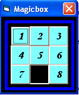



## Magic Box\-\-VI

### Description

This code is for the game - " Magic Squares"
 
### More Info
 
The player need to arrange the numbers in order to win the game

             |
---                |---
**Submitted On**   |2005-07-18 10:20:16
**By**             |[Sincil\.s\.Sreekumar](https://github.com/Planet-Source-Code/PSCIndex/blob/master/ByAuthor/sincil-s-sreekumar.md)
**Level**          |Beginner
**User Rating**    |5.0 (10 globes from 2 users)
**Compatibility**  |VB 6\.0
**Category**       |[Games](https://github.com/Planet-Source-Code/PSCIndex/blob/master/ByCategory/games__1-38.md)
**World**          |[Visual Basic](https://github.com/Planet-Source-Code/PSCIndex/blob/master/ByWorld/visual-basic.md)
**Archive File**   |[Magic\_Box\-1914617182005\.zip](https://github.com/Planet-Source-Code/sincil-s-sreekumar-magic-box-vi__1-61754/archive/master.zip)

